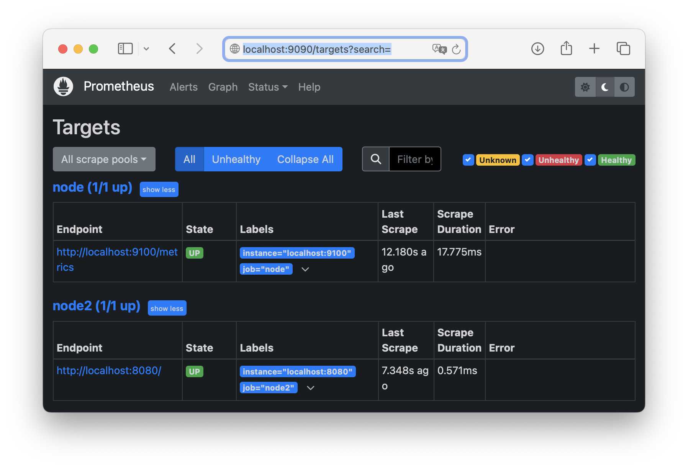
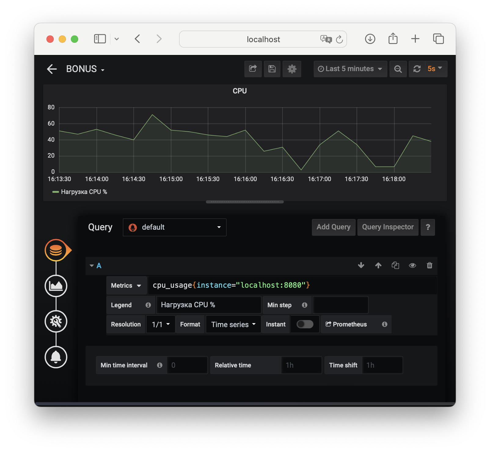

## Part 1. Генератор файлов

- **Написали bash-скрипт. Скрипт запускается с 6 параметрами.**
> Параметр 1 - это абсолютный путь. 
  Параметр 2 - количество вложенных папок.
  Параметр 3 - список букв английского алфавита, используемый в названии папок (не более 7 знаков). 
  Параметр 4 - количество файлов в каждой созданной папке. 
  Параметр 5 - список букв английского алфавита, используемый в имени файла и расширении (не более 7 знаков для имени, не более 3 знаков для расширения). 
  Параметр 6 - размер файлов (в килобайтах, но не более 100).

- **main**

- **error_check**

- **create_files**

- **functionality check**

- **Записали в лог**

## Part 2. Засорение файловой системы

- **Написали bash-скрипт. Скрипт запускается с 3 параметрами.**
> Параметр 1 - список букв английского алфавита, используемый в названии папок (не более 7 знаков). 
  Параметр 2 - список букв английского алфавита, используемый в имени файла и расширении (не более 7 знаков для имени, не более 3 знаков для расширения). 
  Параметр 3 - размер файла (в Мегабайтах, но не более 100).

- **main**

- **error_check**

- **create_files**

- **functionality check**

- **Записали в лог**

## Part 3. Очистка файловой системы

- **Написали bash-скрипт. Скрипт запускается с 1 параметром. Скрипт умеет очищать систему от созданных в Part 2 папок и файлов 3 способами:**
**1. По лог файлу**
**2. По дате и времени создания**
**3. По маске имени (т.е. символы, нижнее подчёркивание и дата)**

- **main**

- **error_check**

- **option1**

- **option2**

- **option3**

- **check option 1**

- **check option 2**

- **check option 3**

## Part 4. Генератор логов

- **Написали bash-скрипт, который генерируюет 5 файлов логов nginx в combined формате.
Каждый лог должен содержать информацию за 1 день.**

Для каждой записи должны случайным образом генерироваться:
1. IP (любые корректные, т.е. не должно быть ip вида 999.111.777.777)
2. Коды ответа (200, 201, 400, 401, 403, 404, 500, 501, 502, 503)
3. Методы (GET, POST, PUT, PATCH, DELETE)
4. Даты (в рамках заданного дня лога, должны идти по увеличению)
5. URL запроса агента
6. Агенты (Mozilla, Google Chrome, Opera, Safari, Internet Explorer, Microsoft Edge, Crawler and bot, Library and net tool)

- **main**

- **functionality check**

- **logs**

> Примечание: остальные файлы 04_log_*.log аналогичны.

## Part 5. Мониторинг

- **Написали bash-скрипт для разбора логов nginx из Части 4 через awk.**

Скрипт запускается с 1 параметром, который принимает значение 1, 2, 3 или 4.
В зависимости от значения параметра вывести:

1. Все записи, отсортированные по коду ответа
2. Все уникальные IP, встречающиеся в записях
3. Все запросы с ошибками (код ответа - 4хх или 5хх)
4. Все уникальные IP, которые встречаются среди ошибочных запросов

- **main**

- **option1**

- **option2**

- **option3**

- **option4**

- **check option 1**

- **check option 2**

- **check option 3**

- **check option 4**

## Part 6. Мониторинг

- **С помощью утилиты GoAccess получили информацию**

> Установили goaccess: `sudo apt-get install goaccess`

- **main**

- **functionality check**

- **report.html**

## Part 7. Prometheus и Grafana

- **Установили и настроили Prometheus и Grafana на виртуальную машину и получили доступ к веб интерфейсам Prometheus и Grafana с локальной машины**

> **Prometheus** - Это инструмент с открытым исходным кодом для анализа показателей производительности любого заданного аппаратного ресурса (CPU, виртуальной машины, облачной виртуальной машины, маршрутизатора и т.д.).
  **Grafana** - это инструмент аналитики и визуализации с открытым исходным кодом

**Prometheus**

> Создали папку в каталоге ~ `mkdir prometheus`

> Скачали бинарный файл с официального сайта `wget https://github.com/prometheus/prometheus/releases/download/v2.48.0-rc.2/prometheus-2.48.0-rc.2.linux-amd64.tar.gz`

> Разархивировали `tar xvfz prometheus-2.48.0-rc.2.linux-amd64.tar.gz `

> Перешли в извлечённый каталог `cd prometheus-2.48.0-rc.2.linux-amd64.tar.gz `
> Запустили сервер prometheus с помощью команды `./prometheus`

> Настроили проброс портов для доступа к адресу. **Примечание:** 2222 порт нужен для соединения с машиной по команде `ssh -p 2222 swissmer@localhost`

> Проверили страницу в браузере `http://localhost:9090`

> Для сбора метрик использовали Node exporter. Принцип работы:

> Установили и запустили Node exporter аналогичным образом.

> Пробросили порты и проверили страницу в браузере `http://localhost:9100`

> Принцип работы **exporter-config.yml**

> Настроили**exporter-config.yml** и перезапустили сервер через команду `./prometheus --config.file=exporter-config.yml`

> Проверили статус Node exporter.

**Grafana**

> Использовали команды:
`wget https://dl.grafana.com/oss/release/grafana_10.2.0_amd64.deb && sudo dpkg -i grafana_10.2.0_amd64.deb && sudo systemctl enable grafana-server && sudo systemctl start grafana-server`
> Пробросили порты и проверили `http://localhost:3000`

- **Добавили на дашборд Grafana отображение ЦПУ, доступной оперативной памяти, свободное место и кол-во операций ввода/вывода на жестком диске**
> Команды для настройки местрики:
> 1. Для CPU: `100 - (avg by (instance)(irate(node_cpu_seconds_total{instance="localhost:9100",mode="idle"}[5m]))) * 100`
> 2. Для RAM: `node_memory_MemFree_bytes{instance="localhost:9100"}`
> 3. Для DISK: `node_filesystem_avail_bytes{instance="localhost:9100", mountpoint="/"}`, `node_filesystem_size_bytes{instance="localhost:9100", mountpoint="/"} - node_filesystem_avail_bytes{instance="localhost:9100", mountpoint="/"}`, `node_filesystem_size_bytes{instance="localhost:9100", mountpoint="/"}`
> 4. Для Count Oparation: `rate(node_disk_reads_completed_total{device="sda", instance="localhost:9100"}[5m])`

- **Запустили наш bash-скрипт из Части 2 и посмотрели нагрузку жесткого диска (место на диске и операции чтения/записи)**

- **Установили утилиту stress и запустили команду `stress -c 2 -i 1 -m 1 --vm-bytes 32M -t 10s` и посмотрели нагрузку жесткого диска, оперативной памяти и ЦПУ**

## Part 8. Готовый дашборд

- **Установили готовый дашборд Node Exporter Quickstart and Dashboard с официального сайта Grafana Labs**
 
 

- **Провели те же тесты, что и в Части 7**
**Тесты с части 2:**

**Тесты с `stress -c 2 -i 1 -m 1 --vm-bytes 32M -t 10s`:**
 

- **Запустили ещё одну виртуальную машину, находящуюся в одной сети с текущей**
> **Примечание:** опускаем настройку внутренней сети в VirtualBox (Предполагая, что читатель знаком с этим) и приступаем к наcтройке ip адресов и маршрутизации:

**r1:**

**r2:**

**Проверим соединение**

- **Запустили тест нагрузки сети с помощью утилиты iperf3**

> Для сервера мы использовали команду iperf3 -s
> Для 2-й машины мы использовали команду iperf3 -c 10.10.0.1 -t 10 -i 1

**Результат:**

## Part 9. Дополнительно. Свой node_exporter

- **Написали bash-скрипт, который собирает информацию по базовым метрикам системы (ЦПУ, оперативная память, жесткий диск (объем))**

**main**

**get_metrics**

**nginx**

> Установили nginx `sudo apt-get install nginx` и пробросили 8080 порт на VirtualBox

**exporter-config**

> Перезапустили сервер через `./prometheus --config.file=exporter-config.yml`

**Результат**

> Заметим, что тут два node_exporter. (Один из предыдущего задания, другой наш, который работает на 8080 порту)

**Dashboard**

**Тест из части 2**

**Тест `stress -c 2 -i 1 -m 1 --vm-bytes 32M -t 10s`**
